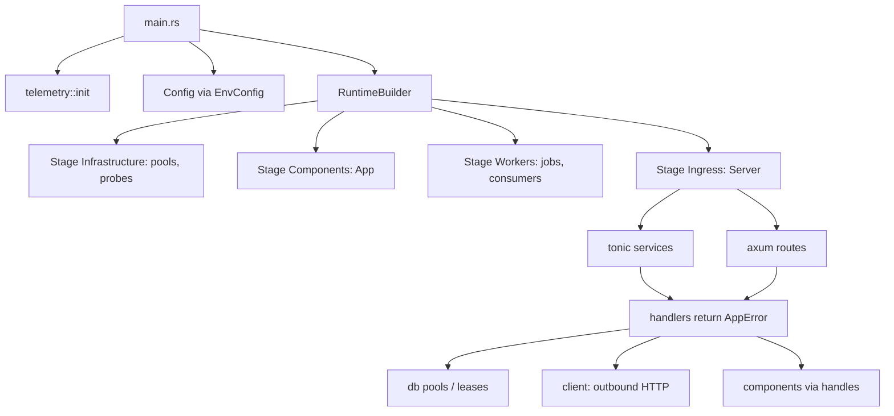

# sekvent documentation

sekvent is a Rust backend framework. A service depends on one facade
package, `sekvent-api` (library name `sekvent`), and turns on the modules it
needs: configuration, an error model, a per-call context, logging, a staged
lifecycle with one server for gRPC, gRPC-Web and REST, jobs, resilience
policies, auth, service-to-service tokens, an outbound HTTP client, databases
with leases, and a component model. The `cargo sekvent` CLI scaffolds
workspaces and runs the quality gate.

## Start here

| Page | Read it to |
|---|---|
| [Getting started](getting-started.md) | Install the CLI, bootstrap a workspace, run and grow your first service |
| [Facade features](features.md) | Pick the Cargo features a service needs; what the prelude brings in |
| [CLI reference](cli.md) | Every `cargo sekvent` command and flag, and the `sekvent.toml` reference |

## Modules

| Module | Feature | Page | In short |
|---|---|---|---|
| `sekvent::config` | `config` | [config](modules/config.md) | `#[derive(EnvConfig)]`, `Secret`, config sources, reserved `SEKVENT_*` keys |
| `sekvent::error` | `error` | [error](modules/error.md) | `AppError`, `ErrorCode`, HTTP and gRPC mappings, boundary logging |
| `sekvent::context` | `context` | [context](modules/context.md) | `CallContext`, deadlines, idempotency keys, `Clock`, header propagation |
| `sekvent::telemetry` | `telemetry` | [telemetry](modules/telemetry.md) | Logging init, formats, access log, request ids, `truncate_for_log` |
| `sekvent::runtime` | `runtime` | [runtime](modules/runtime.md) | Stages, units, supervision, shutdown, health and dependency probes |
| `sekvent::runtime` | `runtime` | [server](modules/server.md) | One listener for gRPC, gRPC-Web and REST; CORS, limits, layers, downloads |
| `sekvent::runtime` | `runtime` | [jobs](modules/jobs.md) | Interval, cron and manual jobs; overlap, misfire, triggers, singletons |
| `sekvent::db` | `db-*` | [db](modules/db.md) | Named pools, migrations, error classification, list filters, probes, leases |
| `sekvent::auth` | `auth` | [auth](modules/auth.md) | argon2id and bcrypt passwords, login helper, JWT with injected time |
| `sekvent::link` | `link` | [link](modules/link.md) | Service-to-service tokens, inbound checks, outbound attachment |
| `sekvent::client` | `client` | [client](modules/client.md) | Outbound HTTP with policies, context propagation, OAuth 2.0 |
| `sekvent::resilience` | `resilience` | [resilience](modules/resilience.md) | Backoff, retries with budgets, rate gate, bulkhead, breaker, TTL cache |
| `sekvent::component` | `component` | [components](modules/components.md) | Components with proto contracts, the `App` builder, bindings, gRPC serving |
| `sekvent-proto-build` | build-dependency | [proto-build](modules/proto-build.md) | `build.rs` codegen with protox (no `protoc`), contract constants |
| `sekvent-testing` | dev-dependency | [testing](modules/testing.md) | Postgres and MySQL containers, `await_until!`, deterministic test rules |

## How the pieces fit

A typical service:

1. `main.rs` initialises logging, loads a `#[derive(EnvConfig)]` struct and
   hands both to a library function that builds the runtime.
2. The runtime starts its stages in order (infrastructure, components,
   workers, ingress) and stops them in reverse on SIGTERM, inside one stop
   deadline.
3. The server serves tonic services and an axum router on one port, with
   health endpoints, CORS, limits, request ids and an access log.
4. Handlers take a `CallContext`, return `AppError`, and reach databases,
   upstream HTTP APIs and other components; time comes from an injected
   `Clock`.
5. Tests run against real Postgres or MySQL containers and use paused tokio
   time and manual clocks instead of sleeps.

## Design notes and examples

| Document | Content |
|---|---|
| [component-model.md](component-model.md) | The component model: goals, bindings, contracts, milestones |
| [design/component-c1.md](design/component-c1.md) | Specification of local bindings and the lifecycle (C1) |
| [design/component-c2.md](design/component-c2.md) | Specification of the gRPC binding, link auth and contracts (C2) |
| [design/p8-service-essentials.md](design/p8-service-essentials.md) | Specification of server essentials, probes, password schemes, jobs, leases, HTTP helpers |
| [examples/shop](../examples/shop/README.md) | Three components (orders, inventory, notifications) in monolith and split topologies |

The pages under `modules/` describe how to use the current code; the design
notes record why it is built that way. When they disagree, the code and the
module pages win.

## Agent skills

The [`skills/`](../skills/) directory holds instructions for coding agents
(`sekvent`, `sekvent-new-project`, `sekvent-migrate`); install them with
`cargo sekvent skills install`. They summarise the same material as these
pages.
