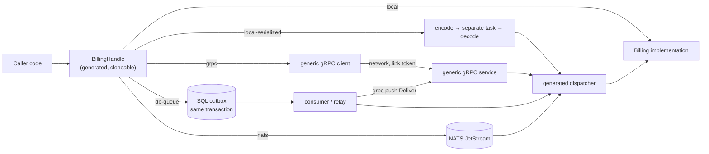

# The sekvent component model

> **Status: milestones C1, C2 and C4 implemented.** C1: the `local` and
> `local-serialized` bindings, `#[call]` methods, the fail-closed App
> builder, lifecycle hooks with draining, per-method timeouts and bulkheads,
> `ComponentError` and the `local_only` / `remote_only` modes, in
> `sekvent-component` (facade feature `component`); see
> [design/component-c1.md](design/component-c1.md). C2: the `grpc` binding
> and serving components over gRPC (facade feature `component-grpc`), link
> authentication, retries, circuit breakers, named policies, bulkhead
> queues, the call-hop limit, proto-first contracts checked at compile time,
> and `cargo sekvent contract emit | check`; see
> [design/component-c2.md](design/component-c2.md). C4: interval, cron
> and manual jobs in `sekvent-runtime` (`RuntimeBuilder::job`, facade
> feature `runtime-cron` for cron) and singleton jobs over a database lease
> with fencing tokens in `sekvent-db` (`LeaseStore`, `LeaseGuard`, facade
> feature `db-lease`); see
> [design/p8-service-essentials.md](design/p8-service-essentials.md). The
> specs win where they are more specific than this document, and
> [examples/shop](../examples/shop) shows C1 and C2 end to end, including a
> split topology. C3 and C5 (see the roadmap below) are still planned: names
> and syntax shown for them are illustrative. The `cargo sekvent` subcommand
> names `component`, `extract`, `queue` and `schedule` are reserved; today
> they exit with status 2 (C4 needs no subcommand: jobs are code).

## Goal

Start a feature as a **component** inside one binary, and later move it into
its own service **by configuration**, without touching the code that calls
it.

A component is a trait with a protobuf contract. Callers hold a generated
handle and never know whether the implementation runs in the same process,
behind a serialization boundary, behind gRPC, or behind a queue. The
semantics of every method (synchronous call, asynchronous request/reply,
durable command) are fixed in code; configuration only picks the transport
that carries them.

## Overview



## Declaring a component

```proto
// billing-api/proto/billing/v1/billing.proto
syntax = "proto3";
package billing.v1;

import "google/protobuf/empty.proto";

service Billing {
  rpc GetInvoice(GetInvoiceRequest) returns (Invoice);
  rpc Quote(QuoteRequest) returns (Quote);
  rpc IssueInvoice(IssueInvoice) returns (google.protobuf.Empty);
}
```

```rust
use sekvent::prelude::*;
use billing_api::proto::{GetInvoiceRequest, Invoice, IssueInvoice, QuoteRequest, Quote};

#[sekvent::component(name = "billing", package = "billing.v1", proto = "crate::proto::billing::v1")]
pub trait Billing: Send + Sync + 'static {
    /// Synchronous request/reply.
    #[call(idempotent, timeout = "2s")]
    async fn get_invoice(&self, cx: &CallContext, req: GetInvoiceRequest)
        -> Result<Invoice, BillingError>;

    /// Request/reply with an explicit, possibly much later, reply.
    #[async_call(timeout = "5m")]
    async fn quote(&self, cx: &CallContext, req: QuoteRequest)
        -> Result<Quote, BillingError>;

    /// Durable one-way command.
    #[deferred]
    async fn issue_invoice(&self, cx: &CallContext, cmd: IssueInvoice)
        -> Result<(), BillingError>;
}
```

(`#[async_call]` and `#[deferred]` are C3; the example shows where they
will sit.) From the trait the macro generates:

- `BillingHandle`: a cheap, cloneable handle that callers store and inject;
- a dispatcher that decodes a request, calls the implementation and encodes
  the reply;
- compile-time checks that the trait and the proto's `Billing` service agree
  exactly: the service name `<package>.<Trait>`, one RPC per method named
  after it in UpperCamelCase, and each RPC's request and reply types.

No per-component tonic code is generated: one generic byte-level gRPC
client and service carry every component over the standard
`/<package>.<Trait>/<Rpc>` paths, reusing the dispatcher.

### Method rules

Every method:

- takes `&self`;
- takes `cx: &CallContext` as its first argument (deadline, request id,
  caller identity, idempotency key);
- takes exactly one owned request, a prost message that is `Send + 'static`;
- returns `Result<Reply, E>` where `Reply` is a prost message (or `()` for
  `#[deferred]`) and `E` is the component's error type;
- has no lifetimes and no generic parameters.

Anything else is a compile error with a message that names the rule.

### Typed errors

```rust
#[derive(Debug, sekvent::ComponentError)]
pub enum BillingError {
    #[reason("INVOICE_NOT_FOUND", code = NotFound)]
    InvoiceNotFound { invoice_id: String },
    #[reason("CREDIT_LIMIT_EXCEEDED", code = FailedPrecondition)]
    CreditLimitExceeded { limit: String },
    /// Anything without a known reason.
    #[other]
    Other(AppError),
}
```

A variant travels as an `AppError` with its `ErrorCode`, a stable reason
code and its fields as error metadata. On the receiving side a known reason
decodes back into the typed variant; an unknown reason (for example from a
newer server) decodes into the `#[other]` variant as a plain `AppError`, so
callers never fail to decode an error.

## Method kinds

The kind is part of the contract; configuration cannot turn a synchronous
call into a queued one or the other way round.

| Kind | Handle returns | Semantics | Bindings |
|---|---|---|---|
| `#[call]` | `Result<Reply, E>` | Synchronous request/reply within the caller's deadline | `local`, `local-serialized`, `grpc` — never a queue |
| `#[async_call]` | `Result<Ticket<Reply>, E>` | Request/reply where the reply arrives explicitly, later | `local`, `local-serialized`, `grpc`, `db-queue`, `nats` |
| `#[deferred]` | `Result<Accepted, E>` | Durable one-way command; `Accepted` once the command is committed | `local`, `db-queue`, `grpc-push`, `nats` |
| `Topic<E>` | `Result<Accepted, _>` on publish | Events published to any number of subscribers | `local`, `db-queue`, `grpc-push`, `nats` |

**`#[async_call]`.** The handle returns a `Ticket<Reply>` carrying a
correlation id. The reply is delivered in one of two ways:

- to a `#[reply_handler]` method on the calling component, which receives
  the correlation id and the `Result<Reply, E>`; or
- through `ticket.await_reply(timeout)`, which waits on a durable reply
  inbox, so a reply that arrives while nobody waits is kept rather than
  lost.

**`#[deferred]` and topics.** `Accepted` means the command or event has been
committed to the binding's queue — with `db-queue`, in the same database
transaction as the caller's business write. The handler runs later, at
least once. The `local` binding keeps the queue in memory; it is meant for
tests and single-process setups where losing queued work on a crash is
acceptable, and production durability needs `db-queue` or `nats`. How
topics are declared and subscribed to is settled in milestone C3.

## Attributes

| Attribute | Applies to | Meaning |
|---|---|---|
| `idempotent` | method | The method may be retried; required for any automatic retry |
| `timeout = "…"` | method | Default deadline, capped by the caller's own deadline |
| `bulkhead = N` | method | At most `N` concurrent executions; excess is shed with `RESOURCE_EXHAUSTED` |
| `#[component(proto = "…")]` | component | The module generated for the component's proto package; required unless `local_only` |
| `#[component(local_only)]` | component | The on-ramp: in-process only, no contract (and no `proto`); the App builder rejects any remote binding |
| `#[component(remote_only)]` | component | Never runs in this binary; the App builder rejects a local binding |

`local_only` lets a feature start as a component before its contract is
stable. Removing the flag and adding the proto `service` with
`proto = "…"` is what opts it into contract checks and remote bindings.

## Contracts and the wire

- The wire format is protobuf from day one, even for components that only
  ever run locally, so that extraction never needs a serialization change.
- Each component has one **`-api` crate** (`billing-api`) holding the
  `.proto` file, the generated messages, the trait, the error type and the
  generated handle. Callers depend only on the `-api` crate; the
  implementation lives in its own crate.
- **The proto is the contract.** The `.proto` declares the component's
  `service` next to its messages; `sekvent-proto-build` (which compiles
  protos in-process with `protox`, so builds need no `protoc`) emits a constant
  describing each service, and `#[component(proto = …)]` checks the trait
  against it at compile time, so the trait and the proto cannot drift. The
  wire is plain gRPC: a client generated from the `.proto` by any toolchain
  calls a sekvent server, and a sekvent `grpc` binding can call any server
  implementing the service.
- `cargo sekvent contract emit` compiles the protos in-process (pure-Rust
  `protox`: no `protoc`, no Rust build) and writes one canonical JSON
  baseline per service; `cargo sekvent contract check` compares the current
  protos with the baselines and fails on wire-breaking changes: a removed
  service or RPC, a changed request or reply type or streaming flag, a
  removed field or enum number that is not reserved, a changed field type,
  cardinality or oneof membership, a dropped reservation, an enum turning
  open or closed. New services, RPCs, fields and values, and renames, are
  compatible (the binary wire carries numbers only). `[contract]` in
  `sekvent.toml` lists the proto roots and adds the check to the gate.
- Error reasons live in Rust (`ComponentError`) and are outside `contract
  check`; an unknown reason always decodes into the `#[other]` variant.
- A breaking change means a new package: `billing.v2` is a second
  component served alongside `billing.v1` from the same binary until every
  caller has moved; then v1 and its baseline are deleted.

## Bindings

| Binding | What happens |
|---|---|
| `local` | Direct call on the implementation; no encoding |
| `local-serialized` | The request is encoded, the `CallContext` goes through the header codec, the call runs on a separate task and the reply or error is encoded and decoded back; the task is aborted when the caller drops the future |
| `grpc` | Unary gRPC call to the component's endpoint (plaintext HTTP/2), authenticated with a link token; the request context travels as headers (`grpc-timeout`, request id, trace, idempotency key, hop count) |
| `db-queue` | SQL outbox and consumer in the component's database (see Bus) |
| `grpc-push` | A relay reads the outbox and pushes messages to the remote service's `Deliver` RPC |
| `nats` | NATS JetStream (later milestone) |

`local-serialized` exercises everything a remote binding would — codec,
headers, error mapping, cancellation — without a network. It is the
**default profile in CI**: the test suite runs with every component bound
`local-serialized`, so a type that does not survive the wire fails a test
long before anyone extracts a service.

Bindings are chosen per component through reserved `SEKVENT_` configuration
keys; every key is accepted under every binding, so one environment serves
every topology:

| Key | Meaning |
|---|---|
| `SEKVENT_COMPONENT_BINDING`, `…_<C>_BINDING` | `local` (default), `local-serialized` or `grpc` |
| `…_<C>_ENDPOINT` | `http://host:port` of the service hosting the component (required for `grpc`; `https://` is not supported yet) |
| `…_<C>_LINK` | link name; the binding presents `SEKVENT_LINK_OUTBOUND_<LINK>` (default: the component name) |
| `…_<C>_AUTH` | `link` (default) or `none` |
| `…_<C>_SERVE` | `grpc` exposes a locally bound component through `App::grpc_routes()` |
| `…_<C>_SERVE_AUTH` | `link` (default: only the process's `SEKVENT_LINK_INBOUND_*` tokens are accepted) or `none` |
| `SEKVENT_COMPONENT_MAX_HOPS` | deepest chain of component calls, default 16 |

A service mounts `App::grpc_routes()` on its `sekvent-runtime` server next
to any other tonic service; per-component `grpc.health.v1` status follows
the component's lifecycle, and `App::start` fails with `GRPC_NOT_MOUNTED`
when an exposed component's routes were never taken. On the serving side
the caller is the authenticated link; end-user subject and tenant survive
only for a link named in `SEKVENT_LINK_TRUSTED`.

Every call carries a hop count (`x-sekvent-hops` across the wire); a call
deeper than `SEKVENT_COMPONENT_MAX_HOPS` fails `FAILED_PRECONDITION` /
`CALL_DEPTH_EXCEEDED` before anything is sent, which stops accidental call
cycles.

## Wiring: the App builder

Components use constructor injection: an implementation receives the
handles and resources (pools, clients, a `Clock`) it needs in its
constructor, never through globals. The practical guide is
[modules/components.md](modules/components.md).

```rust
// Resources are keyed by type: wrap two pools of the same type in newtypes.
let mut builder = sekvent::App::builder(&config_source);
builder.provide(LedgerDb(ledger_pool))?;
builder.provide(BillingDb(billing_pool))?;
LedgerHandle::install(&mut builder, |deps| Ok(Ledger::new(deps.resource::<LedgerDb>()?)))?;
BillingHandle::install(&mut builder, |deps| {
    Ok(Billing::new(deps.handle::<LedgerHandle>()?, deps.resource::<BillingDb>()?))
})?;
let app = builder.build()?;   // every misconfiguration is reported here
```

- The factory runs only when the component is bound `local` or
  `local-serialized`; a remotely bound component constructs nothing and
  needs none of its dependencies or pools.
- Components start in install order and stop in reverse order, as units of
  the runtime.
- The builder fails closed. Every misconfiguration is an error that names
  the variable to fix, never a secret value:
  - a remote binding without an endpoint or a link token, unless
    `…_<C>_AUTH=none` says so explicitly;
  - a component exposed over gRPC without any inbound link token, unless
    `…_<C>_SERVE_AUTH=none`;
  - unknown component configuration keys;
  - installing the same component twice;
  - two components sharing one link token;
  - a `local_only` component bound remotely, or a `remote_only` one bound
    locally;
  - a method kind bound to a transport it does not allow.

## Data ownership

Each component owns its data: it gets its own named pool and its own
database role, and reaches no other component's tables. Other components
read that data through its handle. The distinct-target check of
`sekvent-db` extends to component pools, so two components cannot silently
share credentials. This is what makes extraction a configuration change:
the data already has one owner.

## Resilience

Policies depend on the binding:

| Binding | Policy |
|---|---|
| local | deadline, bulkhead (with an optional bounded queue), load shedding |
| remote (`grpc`) | the deadline across the hop, plus a budgeted retry (`idempotent` methods only, deadline-aware, capped by `Retry-After`) and a circuit breaker per remote component; bulkheads act where the component runs |
| queue (`db-queue`, `nats`) | a bounded number of attempts, then a dead letter; `UNAVAILABLE` from the handler pauses consumption without spending an attempt |

The circuit breaker is sekvent's own (`sekvent-resilience`) and trips only
on `UNAVAILABLE`, `DEADLINE_EXCEEDED` and `RESOURCE_EXHAUSTED`; business
errors never open it. While open, calls fail at once with `UNAVAILABLE` /
`CIRCUIT_OPEN`.

Remote defaults: three attempts for `idempotent` methods (exponential
backoff, a retry budget of 20 % plus 10 per second shared by the
component's methods, a `Retry-After` hint honoured up to 30 s) and a
breaker over the last 20 calls that opens at a 50 % failure rate once 10
calls were seen, stays open 30 s and then lets 3 probes through.
`RETRY_MAX_ATTEMPTS=1` and `BREAKER_ENABLED=false` switch them off.
`TIMEOUT` is the deadline of the whole call, retries included; configuration
never makes a method retryable.

Policy precedence, lowest to highest:

1. the framework default (remote bindings only);
2. the attribute default in code (`timeout`, `bulkhead`);
3. a named policy, `SEKVENT_POLICY_<NAME>_*`, referenced by
   `…_<C>_<M>_POLICY` or else `…_<C>_POLICY`;
4. a component-level override, `…_<C>_<FIELD>`;
5. a method-level override, `…_<C>_<M>_<FIELD>`.

Fields: `TIMEOUT`, `BULKHEAD_MAX_CONCURRENT`, `BULKHEAD_MAX_QUEUE`,
`BULKHEAD_QUEUE_TIMEOUT` and the `RETRY_*` fields per method or component;
`RETRY_BUDGET_*` and `BREAKER_*` per component only, because their state
belongs to the endpoint. A reference to a policy with no keys, or a
`SEKVENT_POLICY_*` key no referenced policy uses, fails the build.

## Schedule

A job is one runtime unit, registered with `RuntimeBuilder::job(name,
stage, spec, run)`; `run` receives a `JobContext` per run (run id, trigger,
tick, fence, cancellation, a root `CallContext`). A failed or panicking run
is recorded in the job's `JobStatus` and never stops or restarts the unit:
the next tick runs. The rules, specified in
[design/p8-service-essentials.md](design/p8-service-essentials.md):

- **Schedules.** `JobSpec::interval(period)`, `JobSpec::cron(pattern)`
  (facade feature `runtime-cron`, parsed with `croner`: five fields, or six
  with leading seconds) and `JobSpec::manual()` (runs only when triggered
  through its `JobHandle`). **Cron runs in UTC**; other time zones are not supported.
- **Fixed cadence.** In-process intervals tick at `start + initial_delay +
  k × period` on tokio's clock, however long the runs take. **Singleton
  intervals are aligned to the Unix epoch** on the wall clock
  (`interval(15m)` fires at :00, :15, :30, :45 UTC), so every instance
  computes the same ticks. Jitter delays a scheduled run without moving the
  grid. The wall clock is injected (`JobSpec::clock`; `TokioWallClock`
  follows `tokio::time::pause`).
- **Overlap:** a run that is still going when the next tick arrives is not
  started twice; the tick is skipped.
- **Misfire:** a tick that starts later than `misfire_grace` (default
  1 min, at least 1 s) is skipped. After a clock jump or a stall, the
  ticks passed over yield one run, never a burst, and count as skipped.
  After downtime, a singleton job runs at most one catch-up for the latest
  missed tick, and only within the grace. In-process jobs have no catch-up
  across restarts.
- **At most once per tick.** A run that died with its process is not
  retried; a timed-out run is dropped (`DEADLINE_EXCEEDED` /
  `JOB_TIMED_OUT`).
- **Singleton jobs** run on one instance at a time:
  `spec.singleton(LeaseGuard::new(LeaseStore::new(&pool)))`. The guard takes
  a per-run lease row in the database at each tick and releases it after
  the run; expiry is computed from the database clock, not the instance
  clock, and a heartbeat renews it while the run lasts. The row remembers
  the last tick, so each tick runs once across all instances. Every
  acquisition increments the row's **fencing token**, which the run reads
  from `JobContext::fence` so its writes can be guarded against a stale
  holder (`LeaseStore::check_fence_postgres` / `check_fence_mysql` inside
  the transaction).
- Losing the lease cancels the running job (`ABORTED` / `LEASE_LOST`).
- **On demand.** `JobHandle::trigger` starts a run now, or fails with
  `JOB_ALREADY_RUNNING`, `JOB_HELD_ELSEWHERE`, `JOB_NOT_RUNNING` or
  `JOB_GUARD_FAILED` (the lease guard could not answer). Jobs
  and direct `LeaseStore::try_acquire` users that share a lease name
  (`LeaseGuard::with_lease_name`) exclude each other.
- The application owns the lease table: `LeaseStore::schema_sql` gives
  the DDL for its migrations, `ensure_schema` creates it, `verify_schema`
  fails startup when it is missing.

## Bus

- The queue is a **SQL outbox** (Postgres and MySQL 8) written in the same
  transaction as the business write, so a command or event is committed
  exactly when the data it describes is.
- Consumers claim batches with `FOR UPDATE SKIP LOCKED`.
- An **inbox** table deduplicates by message id, so at-least-once delivery
  does not run a handler twice for the same message.
- A **relay** forwards outbox rows to a remote service's `Deliver` RPC
  (`grpc-push`) when the consumer lives in another service with its own
  database.
- NATS JetStream comes later as an alternative transport. Redis is not
  used.

## Extraction

`cargo sekvent extract <component>` (planned) turns a locally bound
component into its own service. It scaffolds:

- a service binary crate that hosts the component with a local binding;
- link tokens for both directions of the new link;
- environment templates for the new service and for the callers that now
  bind it remotely;
- a split-topology loopback test that runs caller and service in one test
  over gRPC on port 0;
- a contract baseline for the component.

Call sites do not change: callers already hold the handle.

## Non-goals

- Transactions across components. A multi-step business process is a saga
  written in application code.
- Joins across components' data.
- Exactly-once delivery. Delivery is at least once; the inbox deduplicates.
- Ordering guarantees across messages.
- Streaming RPCs.
- Cancelling work that is already queued.
- Placement, service discovery and deployment. Where a service runs and how
  it is reached is configuration supplied by the environment.

## Roadmap

| Milestone | Scope |
|---|---|
| C1 (implemented) | `local` and `local-serialized` bindings, `#[call]`, the App builder, timeout and bulkhead, `ComponentError`, `local_only` / `remote_only`, an `examples/shop` workspace |
| C2 (implemented) | `grpc` binding and serving with link authentication, circuit breaker, retry and named policies, the hop limit, proto-first contracts with `contract emit` / `contract check`, a `split-grpc` profile in `examples/shop` |
| C3 | The bus (SQL outbox, inbox, relay), `#[async_call]`, `#[deferred]`, topics |
| C4 (implemented) | Schedule: interval, cron and manual jobs (`sekvent-runtime`); singleton jobs over a database lease with fencing tokens (`sekvent-db`) |
| C5 | NATS JetStream, `extract` |
