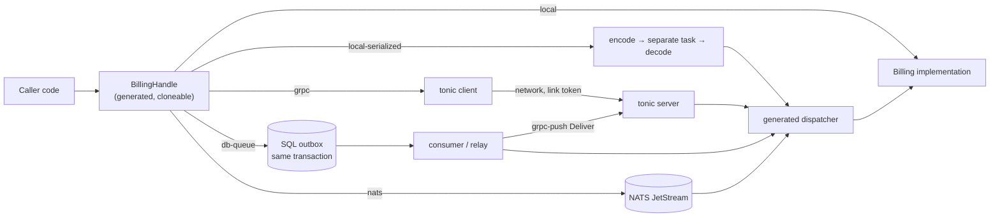

# The sekvent component model

> **Status: milestone C1 implemented.** The `local` and `local-serialized`
> bindings, `#[call]` methods, the fail-closed App builder, lifecycle hooks
> with draining, per-method timeouts and bulkheads, `ComponentError` and the
> `local_only` / `remote_only` modes are in `sekvent-component` (facade
> feature `component`); the exact C1 API, key grammar and semantics are in
> [design/component-c1.md](design/component-c1.md), which wins where it is
> more specific than this document, and [examples/shop](../examples/shop)
> shows them end to end. Everything from milestone C2 on (see the roadmap
> below) is still planned: names and syntax shown for it are illustrative.
> The `cargo sekvent` subcommand names `component`, `contract`, `extract`,
> `queue` and `schedule` are reserved for this work; today they exit with
> status 2.

## Goal

Start a feature as a **component** inside one binary, and later move it into
its own service **by configuration**, without touching the code that calls
it.

A component is a trait with a protobuf contract. Callers hold a generated
handle and never know whether the implementation runs in the same process,
behind a serialization boundary, behind gRPC, or behind a queue. The
semantics of every method (synchronous call, asynchronous request/reply,
durable command) are fixed in code; configuration only picks the transport
that carries them.

## Overview



## Declaring a component

```rust
use sekvent::prelude::*;
use billing_api::proto::{GetInvoiceRequest, Invoice, IssueInvoice, QuoteRequest, Quote};

#[sekvent::component(name = "billing", package = "billing.v1")]
pub trait Billing: Send + Sync + 'static {
    /// Synchronous request/reply.
    #[call(idempotent, timeout = "2s")]
    async fn get_invoice(&self, cx: &CallContext, req: GetInvoiceRequest)
        -> Result<Invoice, BillingError>;

    /// Request/reply with an explicit, possibly much later, reply.
    #[async_call(timeout = "5m")]
    async fn quote(&self, cx: &CallContext, req: QuoteRequest)
        -> Result<Quote, BillingError>;

    /// Durable one-way command.
    #[deferred]
    async fn issue_invoice(&self, cx: &CallContext, cmd: IssueInvoice)
        -> Result<(), BillingError>;
}
```

From the trait the macro generates:

- `BillingHandle`: a cheap, cloneable handle that callers store and inject;
- a dispatcher that decodes a request, calls the implementation and encodes
  the reply;
- a tonic unary client and server for the `billing.v1` package.

### Method rules

Every method:

- takes `&self`;
- takes `cx: &CallContext` as its first argument (deadline, request id,
  caller identity, idempotency key);
- takes exactly one owned request, a prost message that is `Send + 'static`;
- returns `Result<Reply, E>` where `Reply` is a prost message (or `()` for
  `#[deferred]`) and `E` is the component's error type;
- has no lifetimes and no generic parameters.

Anything else is a compile error with a message that names the rule.

### Typed errors

```rust
#[derive(Debug, sekvent::ComponentError)]
pub enum BillingError {
    #[reason("INVOICE_NOT_FOUND", code = NotFound)]
    InvoiceNotFound { invoice_id: String },
    #[reason("CREDIT_LIMIT_EXCEEDED", code = FailedPrecondition)]
    CreditLimitExceeded { limit: String },
    /// Anything without a known reason.
    #[other]
    Other(AppError),
}
```

A variant travels as an `AppError` with its `ErrorCode`, a stable reason
code and its fields as error metadata. On the receiving side a known reason
decodes back into the typed variant; an unknown reason (for example from a
newer server) decodes into the `#[other]` variant as a plain `AppError`, so
callers never fail to decode an error.

## Method kinds

The kind is part of the contract; configuration cannot turn a synchronous
call into a queued one or the other way round.

| Kind | Handle returns | Semantics | Bindings |
|---|---|---|---|
| `#[call]` | `Result<Reply, E>` | Synchronous request/reply within the caller's deadline | `local`, `local-serialized`, `grpc` — never a queue |
| `#[async_call]` | `Result<Ticket<Reply>, E>` | Request/reply where the reply arrives explicitly, later | `local`, `local-serialized`, `grpc`, `db-queue`, `nats` |
| `#[deferred]` | `Result<Accepted, E>` | Durable one-way command; `Accepted` once the command is committed | `local`, `db-queue`, `grpc-push`, `nats` |
| `Topic<E>` | `Result<Accepted, _>` on publish | Events published to any number of subscribers | `local`, `db-queue`, `grpc-push`, `nats` |

**`#[async_call]`.** The handle returns a `Ticket<Reply>` carrying a
correlation id. The reply is delivered in one of two ways:

- to a `#[reply_handler]` method on the calling component, which receives
  the correlation id and the `Result<Reply, E>`; or
- through `ticket.await_reply(timeout)`, which waits on a durable reply
  inbox, so a reply that arrives while nobody waits is kept rather than
  lost.

**`#[deferred]` and topics.** `Accepted` means the command or event has been
committed to the binding's queue — with `db-queue`, in the same database
transaction as the caller's business write. The handler runs later, at
least once. The `local` binding keeps the queue in memory; it is meant for
tests and single-process setups where losing queued work on a crash is
acceptable, and production durability needs `db-queue` or `nats`. How
topics are declared and subscribed to is settled in milestone C3.

## Attributes

| Attribute | Applies to | Meaning |
|---|---|---|
| `idempotent` | method | The method may be retried; required for any automatic retry |
| `timeout = "…"` | method | Default deadline, capped by the caller's own deadline |
| `bulkhead = N` | method or component | At most `N` concurrent executions; excess is shed with `RESOURCE_EXHAUSTED` |
| `#[component(local_only)]` | component | The on-ramp: in-process only, no contract checks yet; the App builder rejects any remote binding |
| `#[component(remote_only)]` | component | Never runs in this binary; the App builder rejects a local binding |

`local_only` lets a feature start as a component before its contract is
stable. Removing the flag is what opts it into contract checks and remote
bindings.

## Contracts and the wire

- The wire format is protobuf from day one, even for components that only
  ever run locally, so that extraction never needs a serialization change.
- Each component has one **`-api` crate** (`billing-api`) holding the
  `.proto`-generated messages, the trait, the error type and the generated
  handle. Callers depend only on the `-api` crate; the implementation lives
  in its own crate.
- `cargo sekvent contract emit` (planned) writes a baseline of every
  component contract; `cargo sekvent contract check` (planned) compares the
  current contracts with the baseline and fails on breaking changes
  (removed or renumbered fields, changed types, removed methods or reasons).
- A breaking change means a new package: `billing.v2` is served alongside
  `billing.v1` until every caller has moved.

## Bindings

| Binding | What happens |
|---|---|
| `local` | Direct call on the implementation; no encoding |
| `local-serialized` | The request is encoded, the `CallContext` goes through the header codec, the call runs on a separate task and the reply or error is encoded and decoded back; the task is aborted when the caller drops the future |
| `grpc` | tonic unary call to a remote service, authenticated with a link token |
| `db-queue` | SQL outbox and consumer in the component's database (see Bus) |
| `grpc-push` | A relay reads the outbox and pushes messages to the remote service's `Deliver` RPC |
| `nats` | NATS JetStream (later milestone) |

`local-serialized` exercises everything a remote binding would — codec,
headers, error mapping, cancellation — without a network. It is the
**default profile in CI**: the test suite runs with every component bound
`local-serialized`, so a type that does not survive the wire fails a test
long before anyone extracts a service.

Bindings are chosen per component through reserved `SEKVENT_` configuration
keys (for example a binding, an endpoint URL and a link name per component),
or through a named profile that sets all of them at once.

## Wiring: the App builder

Components use constructor injection: an implementation receives the
handles and pools it needs in its constructor, never through globals.

```rust
let mut app = sekvent::App::builder(&config_source)?;
LedgerHandle::install(&mut app, |deps| Ledger::new(deps.pool("ledger")?))?;
BillingHandle::install(&mut app, |deps| {
    Billing::new(deps.handle::<LedgerHandle>()?, deps.pool("billing")?)
})?;
let app = app.build().await?;   // every misconfiguration is reported here
```

- The factory runs only when the component is bound `local` or
  `local-serialized`; a remotely bound component constructs nothing and
  needs none of its dependencies or pools.
- Components start in install order and stop in reverse order, as units of
  the runtime.
- The builder fails closed. Every misconfiguration is an error that names
  the variable to fix, never a secret value:
  - a remote binding without a link token, unless the configuration says
    `auth = none` explicitly;
  - unknown component configuration keys;
  - installing the same component twice;
  - two components sharing one link token;
  - a `local_only` component bound remotely, or a `remote_only` one bound
    locally;
  - a method kind bound to a transport it does not allow.

## Data ownership

Each component owns its data: it gets its own named pool and its own
database role, and reaches no other component's tables. Other components
read that data through its handle. The distinct-target check of
`sekvent-db` extends to component pools, so two components cannot silently
share credentials. This is what makes extraction a configuration change:
the data already has one owner.

## Resilience

Policies depend on the binding:

| Binding | Policy |
|---|---|
| local | deadline, bulkhead, load shedding |
| remote (`grpc`) | the above, plus a budgeted retry (idempotent methods only, deadline-aware) and a circuit breaker per endpoint |
| queue (`db-queue`, `nats`) | a bounded number of attempts, then a dead letter; `UNAVAILABLE` from the handler pauses consumption without spending an attempt |

The circuit breaker is sekvent's own (`sekvent-resilience`) and trips only
on `UNAVAILABLE`, `DEADLINE_EXCEEDED` and `RESOURCE_EXHAUSTED`; business
errors never open it.

Policy precedence, lowest to highest:

1. the attribute default in code (`timeout`, `bulkhead`, `idempotent`);
2. a named policy from configuration;
3. a component-level override;
4. a method-level override.

## Schedule

Cron and interval jobs, parsed with `croner`:

- A **singleton** job runs on one instance at a time. The instance holds a
  lease row in the database with a fencing token; expiry is computed from
  the database clock, not the instance clock. The token is handed to the job
  so its writes can be guarded against a stale holder.
- Losing the lease cancels the running job.
- **Overlap:** a run that is still going when the next tick arrives is not
  started twice; the tick is skipped.
- **Misfire:** after downtime, at most one catch-up run happens within a
  grace window; missed ticks never replay as a burst.

## Bus

- The queue is a **SQL outbox** (Postgres and MySQL 8) written in the same
  transaction as the business write, so a command or event is committed
  exactly when the data it describes is.
- Consumers claim batches with `FOR UPDATE SKIP LOCKED`.
- An **inbox** table deduplicates by message id, so at-least-once delivery
  does not run a handler twice for the same message.
- A **relay** forwards outbox rows to a remote service's `Deliver` RPC
  (`grpc-push`) when the consumer lives in another service with its own
  database.
- NATS JetStream comes later as an alternative transport. Redis is not
  used.

## Extraction

`cargo sekvent extract <component>` (planned) turns a locally bound
component into its own service. It scaffolds:

- a service binary crate that hosts the component with a local binding;
- link tokens for both directions of the new link;
- environment templates for the new service and for the callers that now
  bind it remotely;
- a split-topology loopback test that runs caller and service in one test
  over gRPC on port 0;
- a contract baseline for the component.

Call sites do not change: callers already hold the handle.

## Non-goals

- Transactions across components. A multi-step business process is a saga
  written in application code.
- Joins across components' data.
- Exactly-once delivery. Delivery is at least once; the inbox deduplicates.
- Ordering guarantees across messages.
- Streaming RPCs.
- Cancelling work that is already queued.
- Placement, service discovery and deployment. Where a service runs and how
  it is reached is configuration supplied by the environment.

## Roadmap

| Milestone | Scope |
|---|---|
| C1 (implemented) | `local` and `local-serialized` bindings, `#[call]`, the App builder, timeout and bulkhead, `ComponentError`, `local_only` / `remote_only`, an `examples/shop` workspace |
| C2 | `grpc` binding with link authentication, circuit breaker and retry, `contract emit` / `contract check`, a `split-grpc` CI profile |
| C3 | The bus (SQL outbox, inbox, relay), `#[async_call]`, `#[deferred]`, topics |
| C4 | Schedule |
| C5 | NATS JetStream, `extract` |
