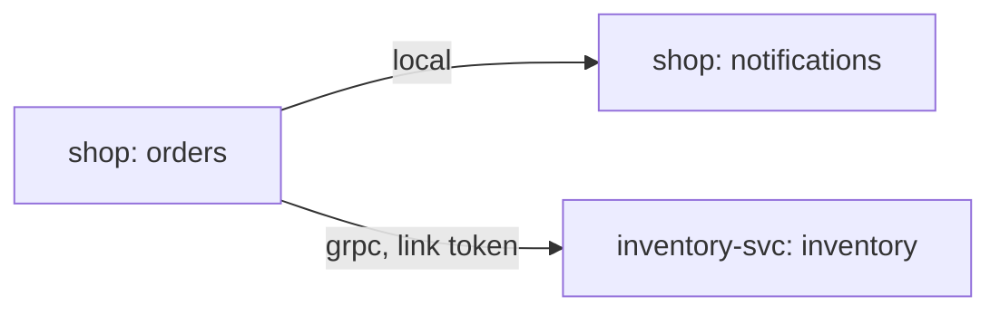

# Example: shop

A small shop built from three sekvent components — inventory, notifications
and orders. It shows milestones C1 and C2 of the
[component model](../../docs/component-model.md) (specs:
[component-c1.md](../../docs/design/component-c1.md),
[component-c2.md](../../docs/design/component-c2.md)): declaring a
component against its proto contract, implementing it, wiring components
together by constructor injection, and moving calls behind a serialization
boundary or into another process by configuration alone.

## Crates

| Crate | What it holds |
|---|---|
| `inventory-api` | `shop.inventory.v1`: the `Inventory` service and messages, the `Inventory` trait (`reserve`, `release`, `stock`), `InventoryError` |
| `inventory` | `InventoryService`: in-memory stock and reservations |
| `inventory-svc` | Inventory as its own service: the component served over gRPC, plus a thin `main.rs` |
| `notifications-api` | `shop.notifications.v1`: the `Notifications` service and messages, the trait (`notify`, `sent`), `NotificationsError` |
| `notifications` | `NotificationsService`: in-memory outbox with a blocklist; opens and closes through `Lifecycle` |
| `orders-api` | `shop.orders.v1`: the `Orders` service and messages, the trait (`place_order`, `get_order`), `OrdersError` |
| `orders` | `OrdersService`: in-memory orders; calls inventory and notifications through their handles |
| `shop` | The wiring (`shop::install`, `shop::bind`, `shop::runtime`), a thin `main.rs`, and the test suite |

An `-api` crate is all a caller needs. `orders` depends on `inventory-api`
and `notifications-api`, never on the implementations.

## Contracts

Each `.proto` declares its component's `service` next to the messages, and
each trait names the generated module with
`#[sekvent::component(…, proto = "crate::proto::shop::inventory::v1")]`. The
macro checks at compile time that the trait and the service agree — the
service name, every RPC, its request and its reply — so the two cannot
drift apart. Because the wire is plain gRPC, a client generated from the
`.proto` by any toolchain can call `inventory-svc`.

[`sekvent.toml`](sekvent.toml) lists the proto roots under `[contract]`, and
the baselines live in [`contracts/`](contracts):

```sh
cd examples/shop
cargo sekvent contract check        # compare the protos with the baselines
cargo sekvent contract emit         # rewrite the baselines after a compatible change
```

A breaking change (a removed field number, a changed type, a removed RPC)
fails `check`; it goes into a new package such as `shop.inventory.v2`
served alongside `v1`.

## How a call flows

`place_order` checks the quantity, reserves stock, notifies the customer and
stores the order. If the notification is refused, it releases the
reservation and returns `OrdersError::CustomerBlocked`. Inventory's
`OutOfStock` and `UnknownSku` are mapped to the orders variants of the same
name; anything else becomes `OrdersError::Other`.

## Bindings

Nothing in the code picks a binding. The App builder reads it:

| Key | Effect |
|---|---|
| (none) | every component `local`: direct calls, no encoding |
| `SEKVENT_COMPONENT_BINDING=local-serialized` | every component behind a prost encode, a separate task and a decode |
| `SEKVENT_COMPONENT_INVENTORY_BINDING=grpc` | inventory in another process (with `…_ENDPOINT` and a link token, below) |
| `SEKVENT_COMPONENT_INVENTORY_RESERVE_TIMEOUT=250ms` | override `reserve`'s `2s` timeout |
| `SEKVENT_COMPONENT_INVENTORY_RESERVE_BULKHEAD_MAX_CONCURRENT=4` | override `reserve`'s bulkhead of 16 (where inventory runs) |
| `SEKVENT_COMPONENT_MAX_HOPS=8` | refuse call chains deeper than 8 components (default 16) |

An unknown `SEKVENT_COMPONENT_*` key or a malformed value fails the build
with a message that names the key. Every key is accepted under every
binding, so one environment serves every topology.

## Split topology

`inventory-svc` hosts inventory; the `shop` binary keeps notifications and
orders and calls inventory over gRPC. The code is the same in both
processes' components; only the environment differs.



| Process | Environment |
|---|---|
| `inventory-svc` | `SEKVENT_COMPONENT_INVENTORY_SERVE=grpc`, `SEKVENT_LINK_INBOUND_SHOP=<token>`, `SEKVENT_LINK_TRUSTED=shop`, optionally `INVENTORY_SVC_ADDR` (default `127.0.0.1:50051`) |
| `shop` | `SEKVENT_COMPONENT_INVENTORY_BINDING=grpc`, `SEKVENT_COMPONENT_INVENTORY_ENDPOINT=http://127.0.0.1:50051`, `SEKVENT_LINK_OUTBOUND_INVENTORY=<token>`, optionally `SHOP_GRPC_ADDR` (default `127.0.0.1:50050`) |

The token is the same value on both sides: the service knows it as the
inbound link `shop`, the shop presents it as the outbound link `inventory`.
Generate one with `openssl rand -base64 32 | tr '+/' '-_' | tr -d '='` (at
least 32 characters of `[A-Za-z0-9_-]`); a process refuses to start without
it, and refuses a token that serves two purposes. `SEKVENT_LINK_TRUSTED=shop`
lets the shop forward its callers' subject and tenant; without it the
service drops them.

On the remote binding the shop retries `idempotent` methods (`reserve`,
`stock`) up to three times within the caller's deadline, never `release`,
and opens a circuit breaker for inventory when it keeps failing with
`UNAVAILABLE`, `DEADLINE_EXCEEDED` or `RESOURCE_EXHAUSTED`. Tune it with
`SEKVENT_COMPONENT_INVENTORY_RETRY_*` and `…_BREAKER_*`, or share settings
through a named policy (`SEKVENT_COMPONENT_INVENTORY_POLICY=remote` plus
`SEKVENT_POLICY_REMOTE_*`).

Both binaries serve `grpc.health.v1` and the HTTP health endpoints. In
`inventory-svc`, `shop.inventory.v1.Inventory` reports `SERVING` while the
component runs and `NOT_SERVING` from the moment shutdown begins; in-flight
calls finish before the listener closes.

## Running

```sh
cargo run -p shop                                                   # all local
SEKVENT_COMPONENT_BINDING=local-serialized cargo run -p shop        # all serialized

# split: two terminals, the same token in both
export TOKEN=0123456789abcdefghijklmnopqrstuvwxyzABCD
SEKVENT_COMPONENT_INVENTORY_SERVE=grpc SEKVENT_LINK_INBOUND_SHOP=$TOKEN \
  SEKVENT_LINK_TRUSTED=shop cargo run -p inventory-svc
SEKVENT_COMPONENT_INVENTORY_BINDING=grpc \
  SEKVENT_COMPONENT_INVENTORY_ENDPOINT=http://127.0.0.1:50051 \
  SEKVENT_LINK_OUTBOUND_INVENTORY=$TOKEN cargo run -p shop
```

Each binary runs its components and its gRPC listener as units of the
sekvent runtime until `SIGINT` or `SIGTERM`.

## Tests

```sh
cargo test -p shop
```

The shared suite runs under three profiles through `rstest` cases:

- `monolith-local` — no keys, every component `local`;
- `monolith-serialized` — `SEKVENT_COMPONENT_BINDING=local-serialized`;
- `split-grpc` — inventory in a second App, served by `inventory-svc` on an
  ephemeral loopback port (`127.0.0.1:0`) under its own runtime, and bound
  `grpc` in the test's App with the environment above. Both Apps run in the
  test process, so fakes still report to the test.

| File | Covers |
|---|---|
| `tests/flows.rs` | placing and reading orders, out-of-stock, unknown SKU, zero quantity, a blocked customer (reservation released), an unknown order, the caller's tenant reaching notifications |
| `tests/faults.rs` | method, caller and configured deadlines; a full bulkhead; cancelled and expired contexts; typed errors and an unknown reason; dropping the caller; draining on stop; the hop limit |
| `tests/runtime.rs` | the App wired as the binary wires it: start, one order, shutdown, every component stopped |
| `tests/remote.rs` | `split-grpc` only: the breaker opening (and business errors never opening it), retries of idempotent methods only, the `Retry-After` cap, the deadline across the hop, wrong and missing tokens, trusted versus untrusted links, graceful shutdown, unmounted routes |

Fault tests swap the real inventory for a fake installed through
`InventoryHandle::install`, so the fake sits behind the same binding. The
monolith profiles run timed tests on tokio's paused clock and assert exact
bounds; a socket needs the real clock, so each timed test has a
`split_grpc` twin that asserts lower bounds only, inside a 30 s guard
against hangs. No test sleeps.
